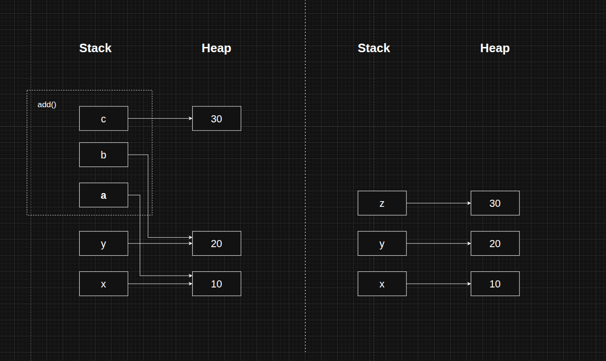

# Python's Memory Management

<br>
<br>
<br>
<br>
<br>

## Index

- [Stack & Heap](#stack--heap)
- [Reference counting](#reference-counting)
- [Garbage collection](#garbage-collection)
- [`pymalloc`](#pymalloc)

<br>
<br>
<br>
<br>
<br>

## Stack & Heap

### Stack

- A stack is used to store:
    - Function call frames
    - Local variables
    - References to heap objects
- Operations on the stack happens in LIFO (last in first out) manner.
- Each function call get its own stack frame.

<br>
<br>

### Heap

- A heap is used to store the actual python objects.
- This contains both mutable (`list`, `dict`, `set`) and immutable (`int`, `str`, `bool`) objects.
- Objects remain in the heap as long as they are **referenced**.

<br>
<br>

### Example

```py
def add(a, b):
    c = a + b
    return c

x = 10
y = 20
z = add(x, y)
```

<br>



<br>

- `10` & `20` objects are created in heap.
- `x` & `y` contain reference to these objects and are stored in stack.
- `add()` function call creates a new stack frame.
- `a` & `b` parameters are pointing to the same `10` & `20` objects in the heap. **Python Interning**.
- After addition, a new object `30` is added to the heap.
- `c` is stored in stack which points to this `30`.
- After function returns, `z` is now holding reference to this `30` object.
- And the function frame is removed from the stack.
- At the end of the program, remaining references and objects are also removed from the stack and heap respectively.

<br>
<br>

### Key points

- Python uses stack for references & function calls.
- Python uses heap for all objects.
- Variables are references, not containers.
- Stack frames are destroyed after function returns.
- Heap objects live as long as their reference count is greater than 0.

<br>
<br>
<br>
<br>
<br>

## Reference counting

- Reference counting is a memory management technique used by Python.
- Each Python object keeps track of how many references are pointing to it.
- This count is called the **reference count**.
- When the reference count hits `0`, the object is immediately deallocated (removed from memory).

<br>
<br>

### Why it is needed?

- Atomatic memory deallocation: No need for the programmer to manually free memory.
- Prevent memory leak: Objects no longer in use are cleaned up immediately.
- Improve performance: Memory is freed as soon as objects are no longer needed.
- Enable deterministic cleanup:
    - Destructors `__del__` run as soon as reference count reaches zero.
    - **Caution**:
        - In cyclic references, reference counts never become zero.
        - Such objects are handled by the garbage collector.
        - Here `__del__` execution is unreliable and not deterministic.

<br>
<br>

### How it works?

- Every Python object internally stores a reference counter.
- Reference counter increases when:
    - An object is assigned to a variable.
    - An object is passed as an argument to a function.
    - An object is stored in a container (list, dict, tuple, etc.).
- Reference counter increases when:
    - A variable referencing the object goes out of scope.
    - A reference is explicitly deleted using `del`.

<br>

```py
a = [1, 2, 3]   # reference count = 1
b = a           # reference count = 2
c = a           # reference count = 3

del b           # reference count = 2
del c           # reference count = 1
del a           # reference count = 0 -> object is deallocated
```

<br>
<br>

### Limitations

- Reference counting cannot handle circular references.

```py
a = []
b = []
a.append(b)
b.append(a)
```

- In this case, reference count never reaches zero.
- Such references are handled by Python's **Garbage Collector**.

<br>
<br>

### Key points

- Python primarily uses reference counting for memory management.
- Objects are freed immediately when reference count reaches zero.
- Reference counting cannot handle circular references. 
- Hence, Python uses garbage collector for circular references.

<br>
<br>
<br>
<br>
<br>

## Garbage collection

- Garbage collection is an automatic memory management mechanism in Python.
- It works alongside reference counting, not as a replacement.
- Python's garbage collector is responsible for finding and freeing unreachable objects, especially those involved in **circular references**.

<br>
<br>

### Why garbage collector is needed?

- Objects involved in circular references, are not cleaned by reference counting.
- This can lead to **Memory leak** if not handled.
- Garbage collector detects such objects and other objects that are no longer reachable and cleans them up.

<br>
<br>

### How it works?

- Python uses a **Generational garbage collection** strategy.
- Objects are divided into three generations:
    - Generation 0: Newly created objects.
    - Generation 1: Objects that survived one GC cycle.
    - Generation 2: Long-lived objects.

---

- When the number of allocations exceeds a threshold:
    - GC runs on Generation 0.
    - Unreachable objects are removed.
    - Surviving objects are promoted to Generation 1.
- Higher generations are collected **less frequently**.
- **Note**: Most objects die young. 

<br>
<br>

### How does GC detect garbage?

- Python uses **Reachability analysis** for garbage collection process.
- Objects reachable from **roots** are considered alive.
- Roots include:
    - Local variables
    - Global variables
    - Stack references
- Objects not reachable from any root are considered **garbage** and are collected.
- Cyclic objects that are unreachable are also collected.

<br>
<br>

### When goes GC run?

- GC runs automatically when generation thresholds are exceeded.
- Generation `i` threshold = Objects allocated in gen `i` - Objects deallocated in gen `i`.
- Garbage collection can be triggered manually using `gc.collect()`.

<br>

```py
import gc

gc.get_threshold()  # (700, 10, 10)

gc.collect()        # Force garbage collection
gc.disable()        # Disable GC
gc.enable()         # Enable GC
```

<br>
<br>

### Key points

- Python uses reference counting as the primary memory management technique.
- Garbage collection is used to handle unreachable objects and circular references.
- Reference counting does immediate deletion; garbage collection runs periodically.

<br>
<br>
<br>
<br>
<br>

## `pymalloc`

- `pymalloc` is Python's specialised memory allocator for small objects.
- It works on top of system's memory allocator (`malloc`).
- It is used only with **CPython**.

<br>
<br>

### Why it is needed?

- If Python made OS calls for every object creation (`malloc`) and deletion (`free`), it will degrade the application performance.
- Pymalloc solves this by getting a block of memory from the OS and reusing it for small objects.
- It handles memory allocation for objects with size <= 512 bytes.
- For objects with size > 512 bytes, memory allocation is handled by the system's `malloc`.
- Most Python objects fall under 512 byte, so `pymalloc` is heavily used.

<br>
<br>

### How it works?

Pymalloc uses hierarchical memory pool system:

```
Arena -> Pool -> Block
```

- **Arena**:
    - Obtains large chunks of memory (~256 kB) from the OS.
- **Pool**: 
    - Fixed-size region inside an arena (~4 KB).
    - Each pool serves objects of one size class (8, 16, 32 bytes).
- **Block**:
    - Small fixed-size units inside the pool.
    - Given directly to Python objects.
    - Sizes are multiples of 8 bytes.

---

Allocation

- Requested size is mapped to the nearest size class.
- A free block is taken from the appropriate pool.
- If needed, new pools or arenas are created.

---

Deallocation

- Freed blocks are returned to their pool.
- Freed arenas are returned to the OS.
- Memory is reused for future allocations.

<br>
<br>

### Key Points

- `pymalloc` is not a garbage collector. It works alongside RC & GC.
- RC & GC tells which memory to free, `pymalloc` handles the deallocation.
- Memory blocks are reused and may not be returned to the OS immediately.

<br>
<br>
<br>
<br>
<br>

## 

<br>
<br>
<br>
<br>
<br>
