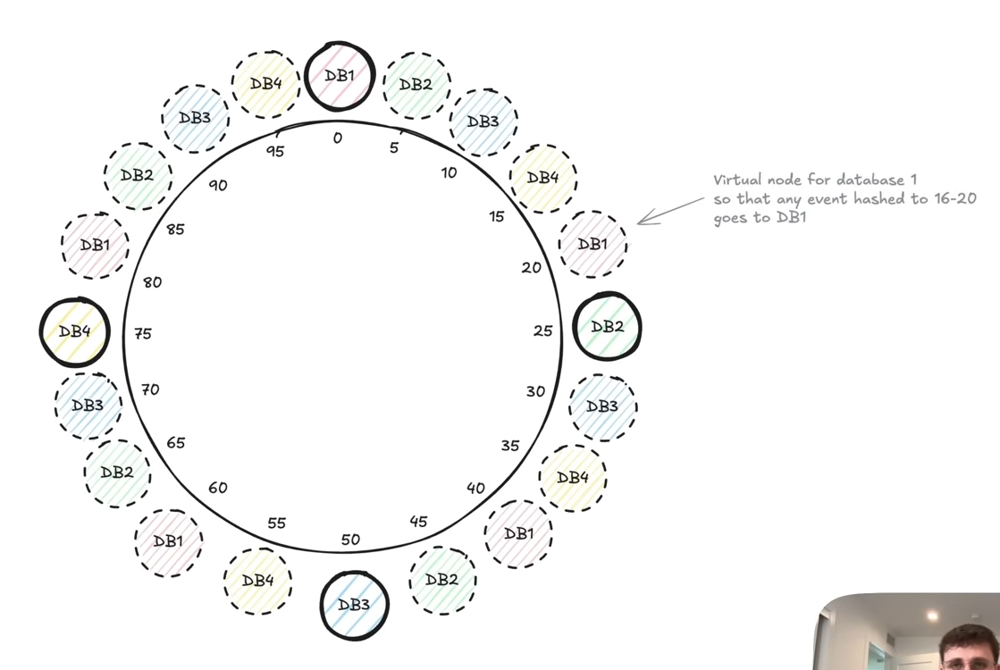

# Hashing

<br>
<br>
<br>
<br>
<br>

## Index

- [What is hashing?](#what-is-hashing)
- [How hashing works?](#how-hashing-works)
- [How hash collisions are handled?](#how-hash-collisions-are-handled)
- [Encoding](#encoding)
- [Encryption](#encryption)
- [Consistent Hashing](#consistent-hashing)

<br>
<br>
<br>
<br>
<br>

### What is hashing?

Hashing:
- Hashing is the process of converting data of any size into a **fixed-size string**.
- The function used is called a **Hash function** and the output is called a **Hash**.
- This process is non-reversible. It is a one-way conversion.
- It is used to verify that the data has not been altered.
- Use cases:
    - Password storage (store hash, not actual password)
    - Data integrity checks (checksums)
    - Hash tables (in-memory key-value lookups)
    - Distributed systems (consistent hashing for sharding)

<br>
<br>
<br>

### How hashing works?

Hash Function:
- A normal function that must follow these 3 rules:
    - **Deterministic**: Same input should always produce the same output.
    - **Fixed length output**: For all possible inputs, the length of the output should be same.
    - **Irreversible**: It should be impossible to reverse engineer the input from the output.

Hash:
- Output of a hash function is called a **Hash**.

Hashing:
- The process of converting a **Key** into a hash is called **Hashing** 

Hash Collision:
- When two or more inputs (Keys) to a hash function returns the same output (Hash) it is called **Hash Collision**.
- A perfect hash function has no collisions at all.
- A good hash function tries to minimise hash collisions.

<br>
<br>
<br>

### How hash collisions are handled?

- There are two major strategies to handle hash collisions:
    - Separate Chaining (Open hashing)
    - Open Addressing (Closed hashing)

<br>

#### Separate Chaining

- Also known as **Open hashing**.
- It uses linked list to store multiple values in the same hash bucket.
- When a hash collision happens, the current key is appended to the end of the linked list.
- This increases the lookup time complexity to `O(k)`, where `k` is number of LL nodes for that bucket.
- If the length of linked list passes a certain threshold, it can be converted to a BST or balanced trees.

```
basdhe: {1: 100}
jaksbd: {2: 200}
askdjn: 
iuehrn: {4: 400} -> {8: 800} -> {3: 300}
poeuan: {5: 500}
```

<br>
<br>

#### Open Addressing

- Also known as **Closed hashing**.
- Here, all data is stored in the hash table itself.
- If a slot is taken, the table probes (searches) for the next free slot.
- Common probing techniques:
    - Linear probing: Check the next slot `i+1`, `i+2`, etc.
    - Quadratic probing: Skip in increasing squares.
    - Double hashing: Use a second hash function to decide probe step.
- The performance of **Open Addressing** degrades quickly at high load factors (>70%).

```
basdhe: {1: 100}
jaksbd: {2: 200}
askdjn: 
iuehrn: {4: 400}
poeuan: {8: 800}
ywuebs: {3: 300}
cjsjao: {5: 500}   # shouled have been at 'poeuan'
```

<br>
<br>
<br>

### Encoding

Encoding:
- Encoding transforms data into a different format using a known scheme, so that it can be safely stored or transmitted and then correctly **decoded back**.
- This process is fully reversible.
- Encoding is not meant to product data from unauthorised access.
- It is used when storing or transmitting data.
- Use cases:
    - Encoding URLs (convert `space` to `%20`).
    - Storing non-ASCII characters in JSON / database.

- It is reversible. Two way.
- About data representation and not security.
- e.g. CSS color hex (#303030) to RGB (48, 48, 48).

<br>
<br>
<br>

### Encryption

Encryption:
- Encryption is the process of converting plain text into **cipher text** using a **key**, so that only authorised parties (with the correct key) can decrypt and access the original data.
- This process is reversible with the correct key.
- It is used to protect the data from unauthorised access.
- Types of encryption:
    - Symmetric Encryption: Same key is used for encryption and decryption.
    - Asymmetric Encryption: Uses a **public** key for encryption and a **private** key for decryption.
- Use cases:
    - HTTPS (secure web communication).
    - Secure file storage.
    - Whatsapp message encryption.

- A key is needed to reverse back to original data.
- e.g. whats app message encryption.

<br>
<br>
<br>

### Consistent Hashing

- It is a technique used in distributed systems.
- It is used to evenly distribute data among a dynamic set of server.
- Compared to normal hashing, it minimizes the data movement when servers are added or removed.
- It is widely used in:
    - Distributed caches
    - Distributed databases
    - Load balancers, etc.

<br>

#### Core problem

- If we hash keys using simple hashing technique:
```
server_index = hash(key) % number_of_servers
```
- Then any change in the number of servers (add/remove) causes almost all keys to be remapped, which is very expensive.

<br>

#### How consistent hashing solves this problem

Hash Ring:

- It creates a virtual **hash ring**.
- This rings contains numbers from `0` -> `2^31 - 1` -> `0`.

---

Server Placement:

- Each server is evenly placed on this hash ring.
- Example:
    - A is places at position `0`.
    - B is places at position `n/4`.
    - C is places at position `n/2`.
    - D is places at position `3n/4`.

---

Server Allocation:

- For each incoming key, it is hashed and a number between `0` to `2^31 - 1` is generated.
- This key is then placed on the hash ring matching that number.
- The next server in the clockwise direction of this key will handle this request.

---

Adding a Server:

- Suppose a new server `X` is added between servers `A` & `B`.
- Let's say the position of this server on the hash ring is `p`.
- Then the requests from `0` to `p` will be handled by server `X` and from `p+1` to `n/4` will be handled by server `B`.
- **Note**: In this case, the data handled by other servers is not affected. Only data in range `0` to `p` is moved to the new server `X`. This is the advantage of using **Consistent hashing** over normal hashing.

---

Removing a Server:

- Suppose we remove the server `B`.
- In this scenario, the data handled by server `B` will now be moved to the next server in the clockwise direction, i.e. server `C`.
- Again note that, data in servers `A` & `D` remain unaffected.

<br>

#### Virtual Nodes

- Also known as VNodes.
- To achieve even data distribution, multiple virtual nodes of each server are hashed onto the ring.
- This reduces the risk of uneven data distribution as seen in the above example of **Removing a Server**.



<br>
<br>
<br>

### 

<br>
<br>
<br>
